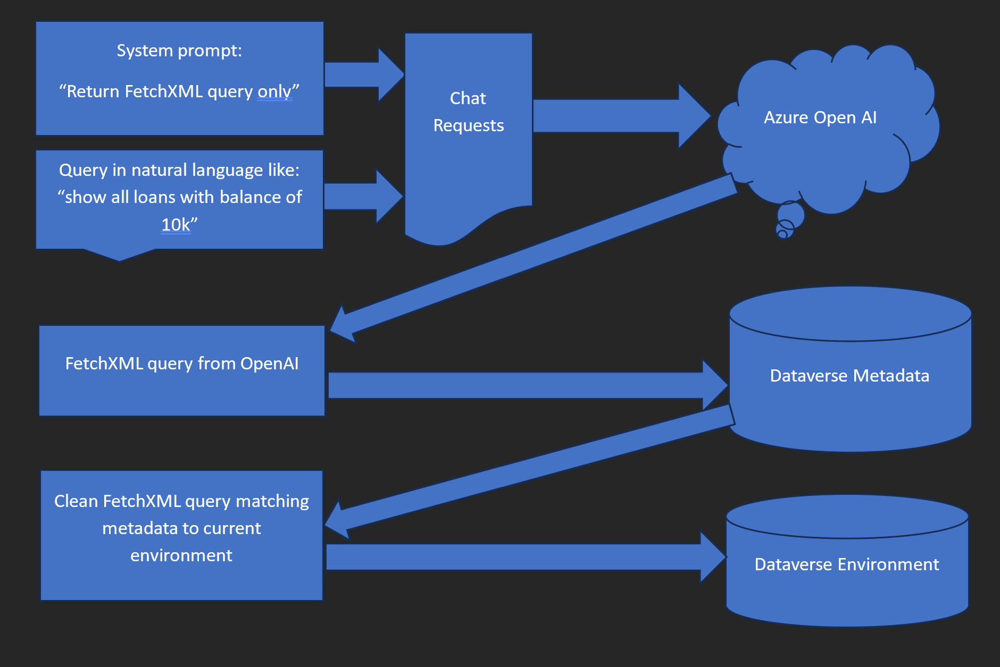

# DataverseSamples

## Dataverse Copilot Demo with PAC CLI

This sample demonstrates how to create simple Dataverse Copilot with [Azure OpenAI](https://azure.microsoft.com/en-us/products/cognitive-services/openai-service)
a litte help of Power Apps CLI library to interact with data stored in Dataverse without any need 
to modify your Dataverse environment or send any of your proprietary data to OpenAI. 
It uses [ChatGPT-3.5 turbo](https://learn.microsoft.com/en-us/azure/cognitive-services/openai/how-to/chatgpt?pivots=programming-language-chat-completions)
model to generate FetchXML queries and any regular Dataverse environment.

Endpoints can be configured in the `appSettings.json` file.

### Interact with data in Dataverse 

### Using custom tables with joins and filters

### Functional flow block diagram

1. User types query in natural language for example: "show me all accounts"	
2. The Copilot example app adds system prompt to the query: "return only FetchXML queries" to instruct AI model to respond with FetchXML queries only
3. AL model resonds with FetchXML query but it cannot be executed because metadata doesn't match current Dataverse environment
4. The app modifies the FetchXML query to fix metadata for tables, attributes, links etc by quering Dataverse metadata API
5. After query matches current Dataverse environment the app executes the query and displays results
6. User can clarify and imporve the query by adding more details like "with name coffee" and chat process starts over again at step 2

