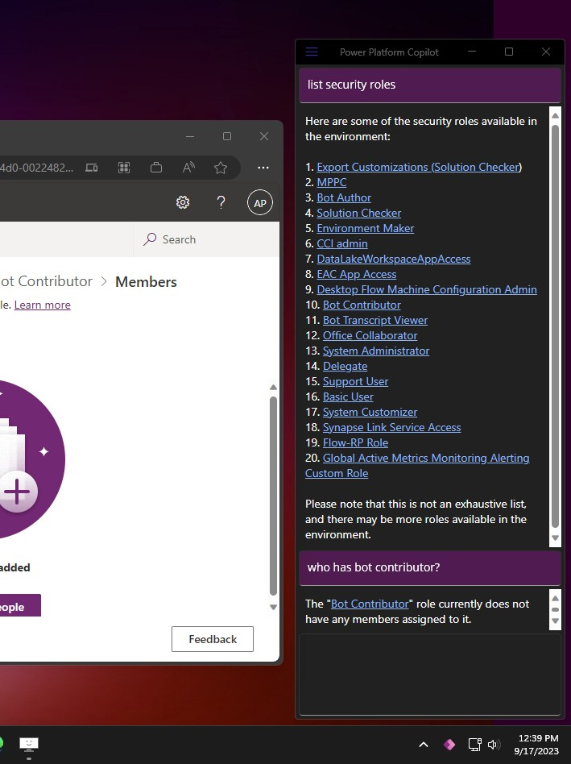

# Experimental: Copilot/AI Assistant for Microsoft Power Platform

> [!WARNING]
> **This repository is still work-in-progress and expected to undergo significant changes**

This is an experimental project to explore the use of Azure AI services with Microsoft Power Platform. 
It is based on the [Dataverse Web API](https://docs.microsoft.com/en-us/powerapps/developer/data-platform/webapi/overview) and the [Azure Cognitive Services](https://azure.microsoft.com/en-us/services/cognitive-services/) with use of [Azure AI Functions](https://learn.microsoft.com/en-us/azure/ai-services/openai/how-to/function-calling).

It can be used as a starting point for building your own Copilot/AI Assistant for Microsoft Power Platform. ConsoleTestApp is a sample console application that demonstrates how to use it. You can add more skills to DataverseAIClient class or derive from it to create your own client. During runtime, the client will automatically discover all skills and their parameters.

## Demos

- [Assign roles](src/docs/assign-roles.md)
- [Find Dataverse Solution and send email to owner](src/docs/send-email.md)
- [Translate Table Descriptions](src/docs/translate-table-descriptions.md)
- [Ask questions about Table Properties](src/docs/table-properties.md)
- [Ask questions about Canvas Apps](src/docs/canvas-app-properties.md)
- [Save Canvas Apps as msapp file to local folder](src/docs/save-msapp-file.md)
- [List available solutions and whats inside them](src/docs/solution-components.md)
- [Share canvas apps](src/docs/share-canvas-apps.md)
- [Switching between Environments](src/docs/switching-environments.md)
- [Listing of roles](src/docs/roles.md)

[Watch All Short Demos](src/docs/Demos.md)

## Screenshots

[Listing of roles](src/docs/roles.md)

## Contributing

This project is welcoming contributions. If you have any questions, feel free to start a [discussion](https://github.com/petrochuk/PowerPlatformCopilot/discussions). I can even give temporary OpenApiKey for testing to people who contribute.

[Copilot/AI Assistant Skills implemented as AI Functons](ListOfSkills.md)

## Running the project

Open appSettings.json and update the following settings:

| Section | Setting | Description |
| ------- | ------- | ----------- |
| TestApp | EnvironmentId | Dataverse environment id |
| AzureAI | OpenApiEndPoint | Azure AI Open API endpoint |
| AzureAI | OpenApiKey | Azure AI Open API key |
| AzureAI | OpenApiModel | Azure AI Open API model which supports Azure AI Functions version **0613** of gpt-35-turbo, gpt-35-turbo-16k, gpt-4, and gpt-4-32k |
| PowerPlatform | AzureAppId | Entra ID Applicatinon that has access to Power Platform |
| PowerPlatform | GraphAppId | Entra ID Applicatinon that has access to Microsoft Graph (can be same application) |
