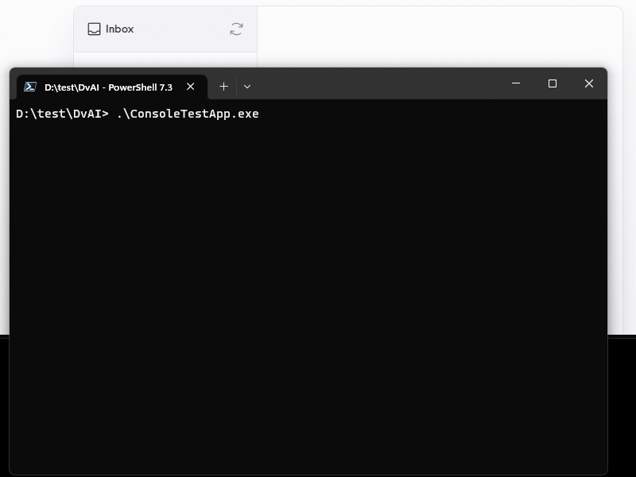
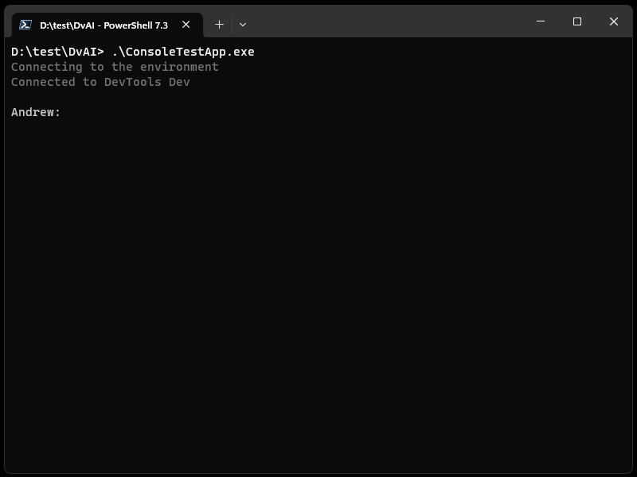
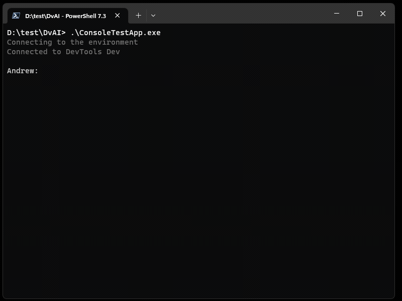

# Demos

## Translate Table Descriptions

Dataverse AI Assistant finds [tables](https://learn.microsoft.com/en-us/power-apps/maker/data-platform/entity-overview) without a description, suggests descriptions and translates them to Spanish.

## Table Properties

Dataverse AI Assistant answering questions about different table properties such as created data, audit, and others.

## Canvas App Properties

Dataverse AI Assistant answering questions about [canvas Power Apps](https://learn.microsoft.com/en-us/power-apps/maker/canvas-apps/getting-started).

## Send Email

Dataverse AI Assistant finds [unmanaged solution](https://learn.microsoft.com/en-us/power-platform/alm/solution-concepts-alm#managed-and-unmanaged-solutions) and sends an email to the owner with a AI generated question.

## Save msapp file

Dataverse AI downloads canvas app as msapp file and saves it local folder.

## Solution Components

Assistant lists available solutions and whats inside them.

## Assign Roles

It has never been easier to assign roles in Power Platform.

## Share Canvas Apps

Copilot makes it easy to share your canvas apps with other users. You can share your canvas app with your colleagues just by entering their first name. It also makes it possible to share multiple canvas apps at the same time.

