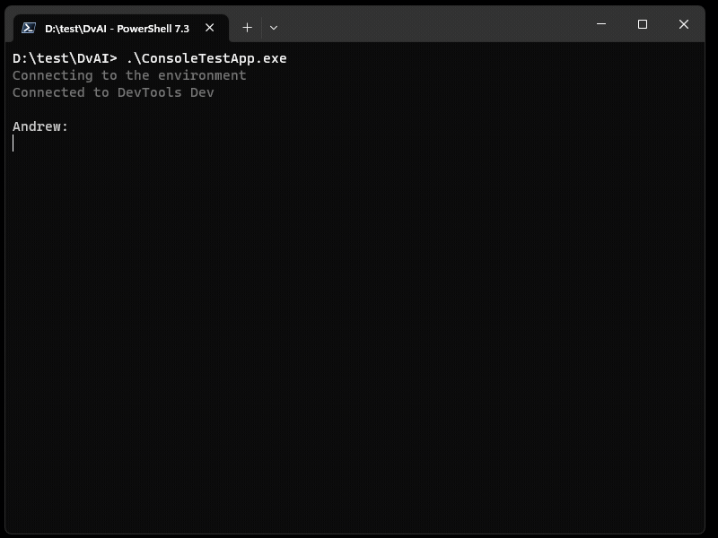
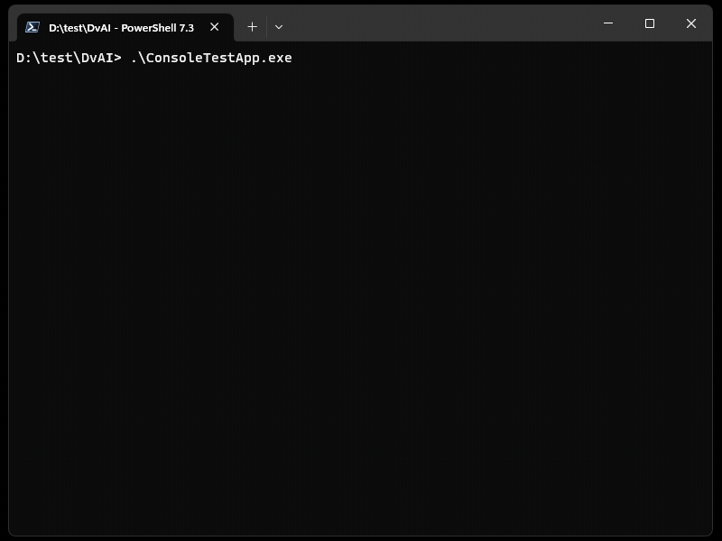

# Demos

## Translate Table Descriptions

Copilot can perform multi step tasks. In this example it finds [tables](https://learn.microsoft.com/en-us/power-apps/maker/data-platform/entity-overview) without a description, suggests descriptions and translates them to Spanish.

## Table Properties

Copilot knows about table properties. You can ask it when a table was created, when it was modified, is it private, is auditing enabled on it, and many more.

## Canvas App Properties

You can ask copilot any question about your [canvas app](https://learn.microsoft.com/en-us/power-apps/maker/canvas-apps/getting-started). For example, you can ask it to show list of all apps, who modified an app last and when, what is the app's description, and many more.

## Send Email

Copilot can send an emails to your colleagues as well. At any point during chat just ask copilot to send follow up email about a list, an app, a solution, or a table and it will write an email for you. In example below copilot Assistant finds [unmanaged solution](https://learn.microsoft.com/en-us/power-platform/alm/solution-concepts-alm#managed-and-unmanaged-solutions) and sends an email to the owner with a AI generated question.

## Save msapp file

Copilot can save your canvas app as a msapp file. Just tell it which app you want to save and folder in My Documents where you want to save it. It will save the app after confirming the file location.

## Solution Components

Copilot understands [Dataverse Solutions](https://learn.microsoft.com/en-us/power-apps/developer/data-platform/introduction-solutions) and what's inside them. You can ask it to show you a list of all solutions, what's inside a solution, and many more.

## Assign Roles

It has never been easier to assign roles in Power Platform with the help of Copilot. You can assign roles to your colleagues just by entering their first name, confirm the role and you are done. Or keep asking copilot to assign roles to more people.

## Share Canvas Apps

Copilot makes it easy to share your canvas apps with other users. You can share your canvas app with your colleagues just by entering their first name. It also makes it possible to share multiple canvas apps at the same time.

## Interact with Power Platform Environments

Copilot makes it easier and faster to switch between environments in Power Platform and apply same filters across different environments. In example below, I have two environments, one DevTools and the other one is ProDov. I ask to list environments published by Microsoft but then I ask to execute same query in ProDov environment. Copilot will automatically switch to ProDov environment and execute the query.

