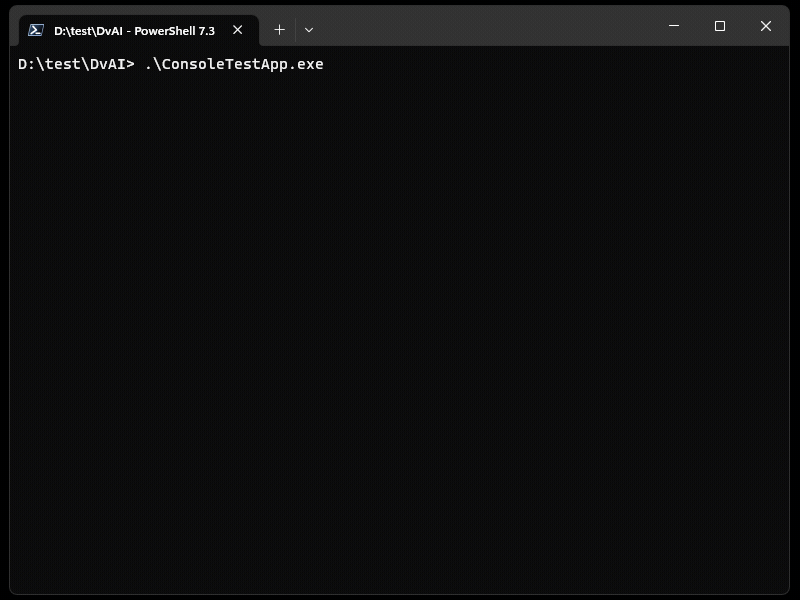

# Canvas App Properties

You can ask copilot any question about your [canvas app](https://learn.microsoft.com/en-us/power-apps/maker/canvas-apps/getting-started). For example, you can ask it to show list of all apps, who modified an app last and when, what is the app's description, and many more.

Some of the available properties include AppVersion, LastDraftVersion, Owner, CreatedBy, CreatedOn, 
ModifiedBy, ModifiedOn, PublishedBy, PublishTime, BackgroundColor, BackgroundImageUri, 
TeamsColorIconUrl, TeamsOutlineIconUrl, DisplayName, Description, CommitMessage, Publisher, 
AppUris, SharedGroupsCount, SharedUsersCount, appOpenUri, appPlayUri, appPlayEmbeddedUri, 
appPlayTeamsUri, authorizationReferences, databaseReferences, Permissions, UserAppMetadata, 
isFeaturedApp, bypassConsent, environment, 
almMode, performanceOptimizationEnabled, canConsumeAppPass, enableModernRuntimeMode, 
executionRestrictions, appPlanClassification, usesPremiumApi, usesCustomApi, 
usesOnPremiseGateway, usesPcfExternalServiceUsage, isCustomizable, and appDocumentComplexity.

Click Play:

Switching back and forth between environments, asking copilot to show last created canvas apps in different environments

