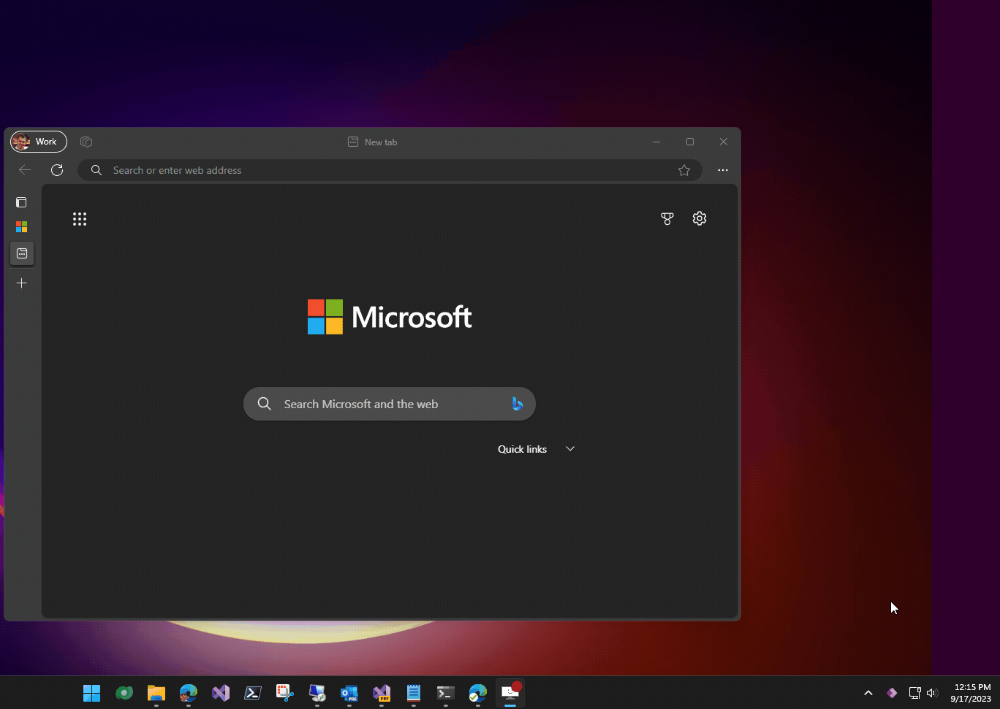

# Table Properties

Copilot has access to the Dataverse security roles and can display members with clickabale links to details. It can check roles privileges and check if role has certain privileges. 

This example also demonstrates a way to interact with Power Platform Copilot from Windows tray icon.

Click Play:

